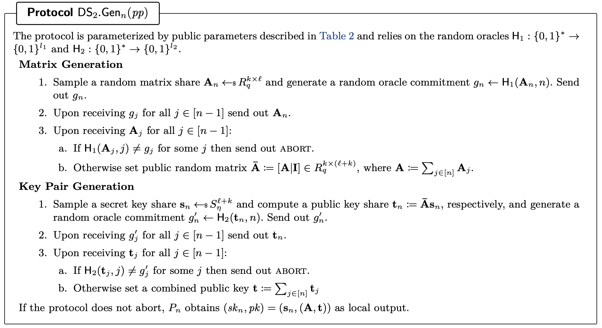
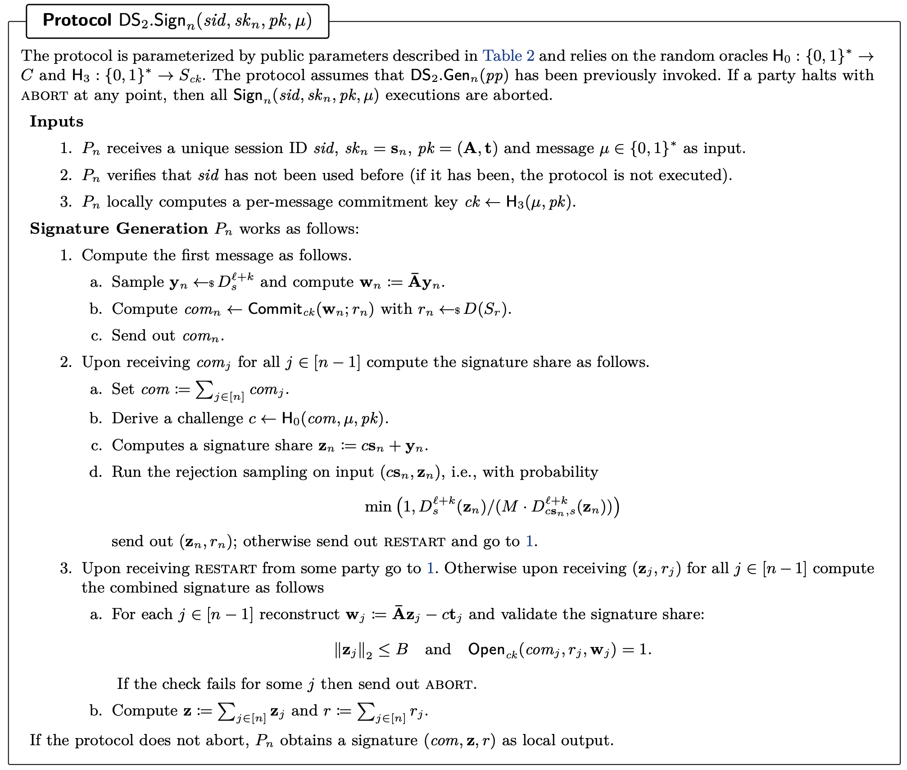
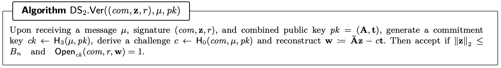
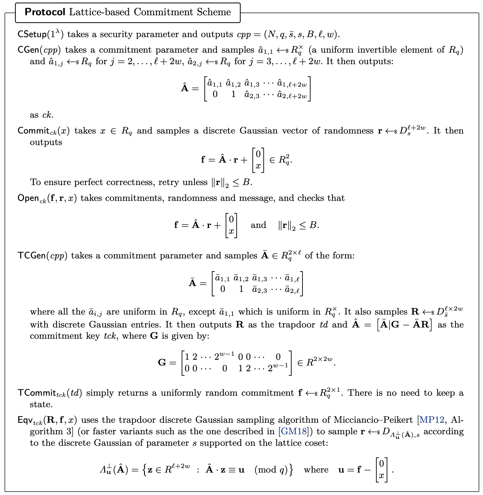

The functions used in each process (gen, sign, verify) in the DS2 protocol are described in `src/bin/gen.rs`, `src/bin/sign.rs`, `src/bin/verify.rs`.

To actually run the entire protocol, you can run `src/bin/ds2.rs` with the following command:

```bash
cargo run --bin ds2
```

This process creates a share of the public and private keys, respectively.



In this process, each party creates its own signature share, and the entire protocol generates signatures.



This process performs verification of the signatures containing the commitments.



The scheme of trapdoor commitment is as follows.
